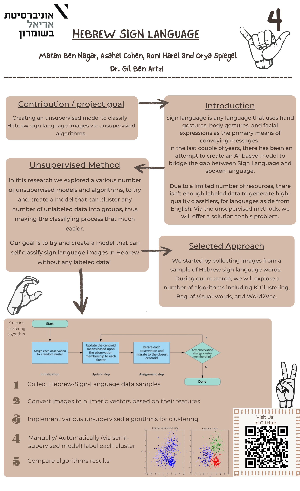
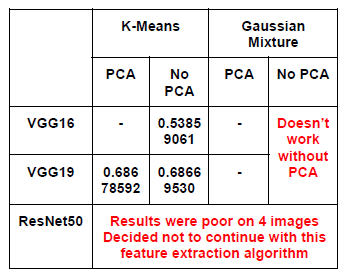

<!-- PROJECT LOGO -->

    

  <h1 align="center">Sign Language Image Clustering</h1>

  

    A research exploring various methods of clustering images

<!-- ABOUT THE PROJECT -->
## Abstract

Communication is very crucial to human beings, as it enables us to express ourselves.  
We communicate through speech, gestures, body language, reading, writing, or through visual aids.  
speech is one of the most commonly used among them.  
Unfortunately, for the speaking and hearing impaired minority, there is a communication gap.  
Visual aids, or an interpreter, are used for communicating with them.  
However, these methods are rather cumbersome and expensive, and can't be used in an emergency.  
Sign Language chiefly uses manual communication to convey meaning.   
This involves simultaneously combining hand shapes, orientations, and movement of the hands, arms, or body to express the speaker's thoughts.
  
Sign Language consists of fingerspelling, which spells out words character by character, and word level association which involves hand gestures that convey the word's meaning.  
Fingerspelling is a vital tool in sign language, as it enables the communication of names, addresses, and other words that do not carry meaning in the word-level association.  
In spite of this, fingerspelling is not widely used as it is challenging to understand and difficult to use.  
Moreover, there is no universal sign language, and very few people know it, making it an inadequate communication alternative

## Poster

    
    

<!-- GETTING STARTED -->
  
## Introduction

Sign Language (SL) is the primary language for the speaking and hearing impaired.  
Each country has its own SL that is different from other countries.  
Each sign in a language is represented with variant hand gestures, body movements, and facial expressions.
The Hebrew Sign Language is the communication method for Hebrew hearing-impaired people.  
Our goal is to improve the dynamic Hebrew Sign Language translation. 
A system for sign language recognition that translates fingerspelling can solve this problem.  
Various machine learning algorithms are used and their accuracies are recorded and compared in this report.  

## Goal

The point of this research is to validate the most efficient algorithm to provide the highest-end image clustering technique.  
We have come across several relevant algorithms that we will explore.  
With each algorithm we will use a few feature extraction techniques, in order to test the efficiency of the algorithms properly.  
The algorithms we used for clustering are K-Means and Gaussian Mixture. 

## Project files

The project consists of a signle Jupyter-Notebook, utilizing various algorithms such as KNN, VGG16, VGG19, PCA.  
We attempted several ways of image clustering. Results of the paper will appear at the end.

## Data

The data we used for our research is in this OneDrive folder -    
https://1drv.ms/u/s!Aqmah9OMflvlgZgjmS9m1ZKQU_n22g?e=hfjwVl  
The compressed file contains 3 folders: test, train and validation.   
All images are images of the Hebrew Alphabet, post processing.  
To simplify the input images, a binary mask is applied, and the hand’s edges are highlighted.  
The binary mask consists of gray-scaling, blurring, and applying thresholding.   
We would like to thank Romansko/SignLanguageRecognition: Hebrew sign language real time recognition using CNN, Keras & OpenCV. (github.com) for making Hebrew SL data available.

## Results

    
    

<!-- USAGE EXAMPLES -->
## References
 * A Brief Introduction to Unsupervised Learning | by Aidan Wilson | Towards Data Science  
* Feature Extraction - MATLAB & Simulink (mathworks.com)  
 * What Is the Mean | How to Find It & Examples (scribbr.com)  
 * Understanding K-means Clustering in Machine Learning | by Education Ecosystem (LEDU) | Towards Data Science  
 * Gaussian Mixture Models (mit.edu)  
 * Gaussian Mixture Models for Clustering | by Vivienne DiFrancesco | Towards Data Science  
 * ResNet-50 convolutional neural network - MATLAB resnet50 (mathworks.com)  
 * Everything you need to know about VGG16 | by Great Learning | Medium  
 * Centroid — Google Arts & Culture  
 * Dimension_reduction (deepnote.com)  
 * Principal Component Analysis | LinkedIn    

<!-- ROADMAP -->

## CONTRIBUTORS ✨

<!-- ALL-CONTRIBUTORS-LIST:START - Do not remove or modify this section -->
<!-- prettier-ignore-start -->
<!-- markdownlint-disable -->
<table>
  <tr>
    <td align="center"><a href="https://github.com/Orya-s"> <b>Orya Spiegel</b></a>  </td>
      <td align="center"><a href="https://github.com/asahelcohen/"> <b>Asahel Cohen</b></a>  </td>
  </tr>
    <td align="center"><a href="https://github.com/Roniharel100/"> <b>Asahel Cohen</b></a>  </td>
  <td align="center"><a href="https://github.com/matannagar/"> <b>Matan-Ben Nagar</b></a>  
    </td>
    </tr>
</table>
